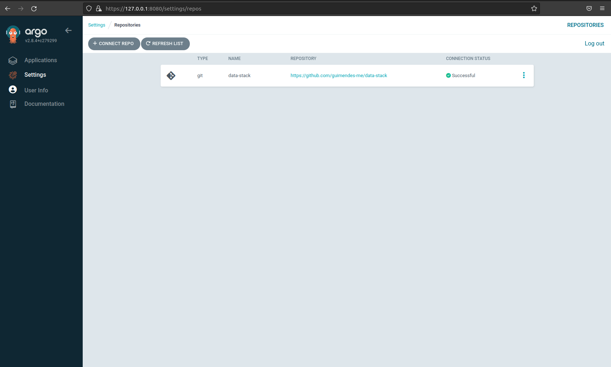

# Visão Geral

O ArgoCD será a ferramenta responsável por gerenciar os deploys no kubernets e também controlar todo fluxo GitOps mantendo nossas aplicações atualizadas. A instalação é bem fácil, basta seguirmos os passos da [Doc Oficial](https://argo-cd.readthedocs.io/en/stable/getting_started/), ou basta seguir os passos abaixo.

## Instalação

````shell
kubectl apply -n argocd -f core-install.yaml
````

## Configurando o acesso inicial

````shell
argocd admin initial-password -n argocd
````

## Acessando localmente

Como não temos nenhum ingress configurado, será necessário fazer o acesso via port forward.

````shell
kubectl port-forward svc/argocd-server -n argocd 8080:443
````

Após isso basta acessar localmente pelo endereço 127.0.0.1:8080 e com usuário admin e a senha que apareceu no terminal no passo anterior


## Criando conexão repositório

Com o ambiente no ar, vamos criar a primeira conexão com nosso repositório.

````shell
kubectl apply -f repositories/data-stack.yaml
````

